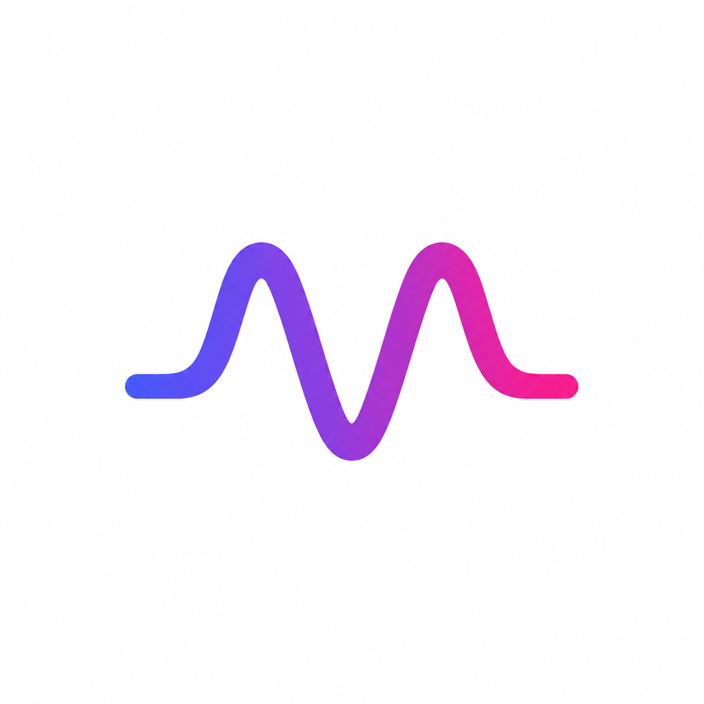
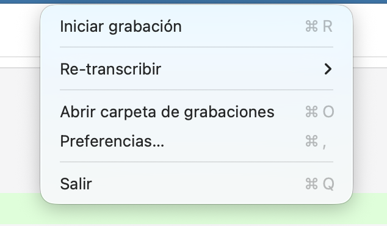
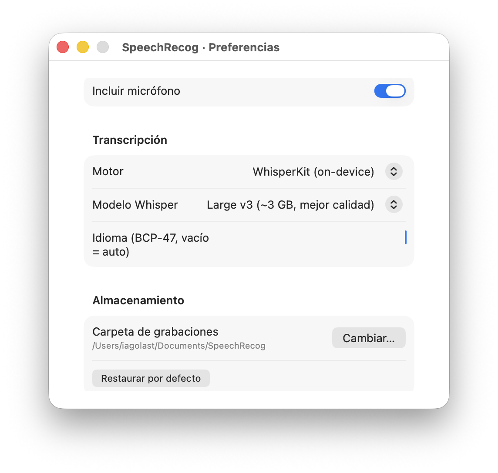

<p align="center">
  
</p>

<h1 align="center">SpeechRecog</h1>

<p align="center">
  Record system audio + microphone and auto-transcribe to subtitles.<br/>
  Lives in your menu bar. macOS 14.2+ only. No drivers needed.
</p>

<p align="center">
  
  &nbsp;&nbsp;
  
</p>

---

## Install

```bash
curl -fsSL https://raw.githubusercontent.com/IagoLast/SpeechRecog/master/scripts/install.sh | bash
```

Requires macOS 14.2+ and Xcode Command Line Tools (`xcode-select --install`).

## Features

- **System audio capture** — Records everything playing on your Mac (meetings, music, videos) using Core Audio Process Taps. No virtual audio drivers needed.
- **Microphone mixing** — Optionally mix your microphone input into the recording so both sides of a conversation are captured in one file.
- **Auto-transcription** — Generates `.srt` subtitles automatically when you stop recording. Choose between WhisperKit (on-device, private) or Apple Speech.
- **Multiple Whisper models** — From Tiny (~75 MB, fast) to Large v3 (~3 GB, best quality). Models download automatically on first use.
- **Language detection** — Auto-detects the spoken language, or set a specific BCP-47 code (e.g. `es`, `en-US`, `pt-BR`).
- **Custom recordings folder** — Save recordings anywhere on your Mac.
- **Menu bar app** — Doesn't clutter your Dock. Keyboard shortcuts for everything.
- **Re-transcribe** — Re-run transcription on any past recording with a different model or engine.

## How it works

1. A **Process Tap** captures all system audio, excluding SpeechRecog's own PID
2. A private **Aggregate Device** keeps audio playing through your speakers/headphones normally
3. An **IOProc** writes the audio stream to `.m4a` (AAC), optionally mixing in microphone input
4. On stop, the configured transcription engine generates an `.srt` file alongside the recording

Recordings are saved to `~/Documents/SpeechRecog/` by default (configurable in Preferences).

## Usage

1. Launch the app — a waveform icon appears in the menu bar
2. Click **Start recording** (`Cmd+R`) — icon turns to a red circle
3. Have your meeting / call as usual
4. Click **Stop recording** — icon shows a progress indicator while transcribing
5. Click **Open recordings folder** (`Cmd+O`) to find your `.m4a` + `.srt`

## Preferences

| Setting | Description |
|---|---|
| **Include microphone** | Mix mic input into the system audio recording |
| **Transcription engine** | WhisperKit (on-device) or Apple Speech |
| **Whisper model** | Tiny / Base / Small / Medium / Large v3 |
| **Language** | BCP-47 code or empty for auto-detection |
| **Recordings folder** | Where `.m4a` and `.srt` files are saved |

## Build from source

```bash
git clone https://github.com/IagoLast/SpeechRecog.git
cd SpeechRecog
make install              # build + copy to /Applications
```

Other targets:

```bash
make run                  # build + open from ./build (no install)
make uninstall            # remove from /Applications
make clean                # delete build artifacts
```

Install to a custom location:

```bash
make install INSTALL_DIR=~/Applications
```

Sign with your Developer ID:

```bash
CODESIGN_IDENTITY="Developer ID Application: ..." make install
```

## Permissions

On first launch, macOS will prompt for:

- **Screen Recording** — Required for Process Taps to capture system audio
- **Microphone** — Required only if "Include microphone" is enabled

## Known limitations

- Changing the audio output device mid-recording won't be picked up — stop and restart the recording
- Not sandboxed: Process Taps require `com.apple.security.device.audio-input` entitlement outside the App Sandbox

## License

MIT
